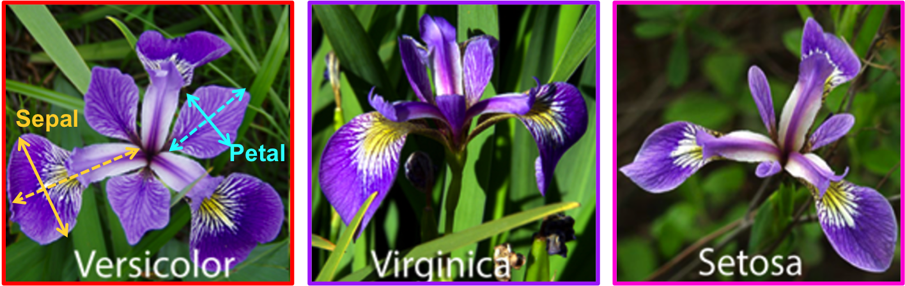

```{r setup, include=FALSE}
knitr::opts_chunk$set(echo = TRUE)
```

Data visualization is an important tool for both data exploration and for communicating your results effectively to peers and to the public. Today we will show you some of the things you can do using base R plotting functions to explore the CO2 dataset. A package called ggplot2, part of a larger set of packages known as the "tidyverse," is popular for data visualization. We will introduce you to ggplot2 on the final day of class, but we first want to give you a good grounding in base R plotting functions.   

Before we get started, let's save the CO2 data again from the internal `datasets` package as an object in our workspace.
This dataset contains observations of CO2 uptake by plants originating from
different locations (Quebec and Mississippi) and under different temperature treatments (chilled and not chilled) across different fixed ambient CO2 concentrations.  

```{r}
?CO2
CO2 <- datasets::CO2
```  

The head() function lets us take a quick look at the data - three columns of character vectors and two numeric columns:  

```{r}
head(CO2)
```  

str() shows us more specific information about the structure of the data:  

```{r}
str(CO2)

```  

Questions: what units are the uptake rate in?  

## Different Plot Types

### Plotting univariate data

#### **Histograms** - groups the data into bins (default or custom defined) spanning the range of the data, and displays the frequency of each bin.  

```{r}
?hist
```  

Examples:  

```{r}

hist(CO2$uptake)

```  

#### **Density plots** - Smooths univariate data into a continuous density along its range.  

```{r}
?density # Combine with plot() to vizualize; i.e. plot(density(x))
```  

Example:  

```{r}

density(CO2$uptake)

plot(density(CO2$uptake))

```  

#### **Dotcharts** - Displays all point values along one dimension. The X-axis corresponds to the value you are plotting, while the Y-axis separates out the different data points  

```{r}

?dotchart
```  

Examples:  

```{r}
dotchart(CO2$uptake)

```  
 
Note, you can also specify a grouping factor to divide the points and visually compare by group  

```{r}

# separate out data by plant origin
dotchart(CO2$uptake, groups = CO2$Type) 

# And do the same for the different treatments (chilled vs. non-chilled)
dotchart(CO2$uptake, groups = CO2$Treatment) 

```  

You might also be interested in what the data looks like for different plant origins when divided up by treatment. You can use the "col" argument to color by a factor level:  

```{r}

dotchart(CO2$uptake, groups = CO2$Treatment, col = CO2$Type) 


```  

But, which color corresponds to Quebec, and which to Mississippi? You can add a legend using the same factor levels to make this clear:  

```{r}

# Set the marker type so it is the same in the plot and in the legend. 
dotchart(CO2$uptake, 
         groups = CO2$Treatment, 
         col = CO2$Type,
         pch = 19)  

legend(x = "topright",
       # Using levels() here pulls out the unique factor levels for your
       # legend text, in the same order that it gets colored above.
       legend = levels(CO2$Type), 
       # For coloring the marker, you want a series of numbers that 
       # are the same length as the items in the legend. 
       # This pulls out that number of colors from the current palette 
       # you have set in R (more on this later)
       col = 1:length(CO2$Type), 
       pch = 19)

```  

Question: so far in our visual data exploration, what have you noticed about CO2 uptake by plant country origin?  What about by treatment?  

### Plotting two or more variables 

#### Scatterplots: 2 continuous variables  

We can use a scatterplot to look at how uptake rate changes with ambient CO2 concentration:  

```{r}
plot(x = CO2$conc, 
     y = CO2$uptake)

# an alternative way of writing the above is:

plot(formula = uptake ~ conc, 
     data = CO2)


```  

Tip: the tilde signifies that the left side variable is a response (i.e., the "y" variable) to the right side variable (i.e., the "x" variable). The same notation is used in statistical modeling, which you will see tomorrow.  

#### Box plots - Groups the data along discrete factors, and displays the median, interquartile range (whiskers), and outliers
You can do this 2 ways: specify a categorical (factor level) X variable in plot(), which will automatically produce a boxplot, or use the boxplot() function directly.  

```{r}

plot(x = CO2$Treatment, 
     y = CO2$uptake) 
```  

Before using the boxplot function, let's take a quick look at its help file to understand the different arguments:  

```{r}
?boxplot
boxplot(formula = uptake ~ Treatment, 
        data = CO2)


```  


### Doing science  

Let's now take a closer look at the different plot types using our CO2 dataset to ask biological questions and explore hypothesized relationships between the variables.  

#### Scatterplots  

Changing ambient CO2 should affect CO2 uptake - we predict that less CO2 available might result in a slower uptake rate. Can we see this in the data?  

We are interested in two numeric variables, so let's look at a scatterplot of our data:  

```{r}
class(CO2$conc)
class(CO2$uptake)

plot(x = CO2$conc, y = CO2$uptake)
```  

The ambient concentration variable was a fixed variable, so we have several observations within single values, which is why the plot looks discontinuous.  We might also be interested in the averages of CO2 uptake within each ambient CO2 concentration:

First let's get the means:  
```{r}

(uptakeMeans <- aggregate(uptake ~ conc, data = CO2, FUN = mean))
names(uptakeMeans) <- c("conc", "mean")

```  

We could plot the means, then add the original data points to see the total sample spread of data around the mean. (Honestly, this is just to illustrate the ability to add things to a plot with functions such as points and lines)  

```{r}

plot(mean ~ conc, 
     data = uptakeMeans,
     # set the pch to a solid dot to differentiation the mean from the 
     # rest of the data
     pch = 19, 
     # Change the y limits to accomodate the total data spread.
     ylim = c(min(CO2$uptake), max(CO2$uptake))) 
     
points(CO2$uptake ~ CO2$conc, col = "grey")
```  

For fun, lets add a line across the means too.  
 

```{r}

plot(mean ~ conc, 
     data = uptakeMeans,
     pch = 19,
     ylim = c(min(CO2$uptake), max(CO2$uptake))) 
     
points(CO2$uptake ~ CO2$conc, col = "grey")

lines(mean ~ conc, 
      data = uptakeMeans)


```  

But instead of plotting all the data with the means, it's usually a good idea to plot some kind of error bar around each mean to succinctly show variation around the average. Different error bars serve different purposes. Since we are just interested in looking at the spread of our uptake data at each ambient CO2 concentration, we will add standard deviation bars.  

```{r}

# First, let's get the sds, aggregated by concentration. 
(uptakeSD <- aggregate(uptake ~ conc, data = CO2, FUN = sd))
names(uptakeSD) <- c("conc", "sd")

plot(mean ~ conc, 
     data = uptakeMeans,
     ylim = c(0, 45)) 
# we again expanded the default Y-axis limits to accomodate the sd bars. 
# I chose these values throuh quivk plotting trial and error, 
# but you could also add/substract the sd from the min and max uptake values 
# to know where your bounds should be at minimum. 

# like lines() and points(), arrows() adds arrows to an already existing plot.
# It literally plots arrows, but we set the length of the arrowheads to be 0 for 
# a clean bar without caps.  You could add the arguments (angle = 90, length = XX, code = 3) 
# to draw more typical error bar caps of a given length instead. 

arrows(x0 = uptakeMeans$conc, 
       y0 = uptakeMeans$mean - uptakeSD$sd,
       y1 = uptakeMeans$mean + uptakeSD$sd,
       length = 0)

# x0, x1 and y0, y1 are where you draw the start (0) and end (1) of the bars. 
# x1 and y1 default to x0 and y0 unless you specify otherwise.  
# Note, you cannot specify only x0, and y0, as then you will be drawing points.  

```  


You can also plot this directly as a line plot by setting the "type" argument to "l" for lines or "b" for both points and lines. It defaults to "p" for points.  

```{r}
plot(mean ~ conc, 
     data = uptakeMeans,
     ylim = c(0, 45), 
     type = "b")
arrows(x0 = uptakeMeans$conc, 
       y0 = uptakeMeans$mean - uptakeSD$sd,
       y1 = uptakeMeans$mean + uptakeSD$sd,
       angle = 90,
       code = 3,
       length = 0.1) 


```  

Commentary: There's an increase in uptake as the concentration gradient increases, but it doesn't really increase much after ~250 uL/L. It may imply that CO2 concentration is only a limiting factor at very low levels and does not drive uptake at higher concentrations.  

Let's look at some ways we can make our plots look a little better and be more easily interpreted.
First, we can add some labels and a title:  
```{r}
plot(x = CO2$conc, y = CO2$uptake, 
     xlab = 'CO2 Conc. uL/L', 
     ylab = 'CO2 Uptake (umol/m^2 sec)', 
     main = 'CO2 Uptake Under Ambient CO2 Conc.')
```  

We can also improve the text using expression() to print special characters,increase the font size of our axis labels (cex.lab), and change the type of marker for our points (pch).  We'll use par to increase font size and set marker type, as well as increase the margins around our plot window to accomodate the larger axis labels (mar).  

```{r}
?par
par(mar = c(5, 4, 4, 2) + 1, 
    cex.lab = 1.5, 
    pch = 19)
plot(x = CO2$conc, y = CO2$uptake, 
     xlab = expression(paste(CO[2] ," conc. uL/L")), 
     ylab = expression(paste(CO[2], " uptake umol/", m^2 ," sec")), 
     main = expression(paste(CO[2], " uptake Under Ambient ", CO[2], " Conc.")))

```  
Note, par() is useful if you want to set plot specifications for the plotting window, as well as any plots following, but many of the arguments could be used directly in the plot function too for a specific plot.  

Using expression() with paste() allows us to print special characters in our plot text.  You can do a google search to find examples online for the type of special character you need to print. Above, you can see that m^2 prints 2 as a superscript, while [2] prints 2 as a subscript. You don't actually need quotations around any of the text in expression(), but they allow you to add spaces where necessary.  


Biological processes are usually temperature mediated. We should expect higher respiration (CO2 uptake) with higher temperatures. Using levels() shows us the unique factors from a 'factor' vector.  

```{r}
levels(CO2$Treatment)
```  

We're interested in the distribution of CO2 uptake as it relates to treatment. Different ways we can visualize this:
  + Box plot - grouping along a discrete variable (treatment), display distribution of data in each group
  + Density plot with line type determined by factor
  + Scatterplot colored by factor level  

#### Box plot:  

```{r}

boxplot(uptake ~ Treatment, data = CO2, notch = TRUE) 
# including notch = TRUE provides evidence that the  medians differ if the notches do not overlap

```  
Our boxplot indicates there is some effect of treatment. As we predicted, CO2 uptake is lower in the chilled conditions. But we have yet to do a statistical test!  

#### Density plot  

```{r}
plot(density(CO2[CO2$Treatment == "nonchilled", "uptake"]), 
     col = "red", 
     type = "l", 
     main = "CO2 uptake by treatment",
     lty = 1)

lines(density(CO2[CO2$Treatment == "chilled", "uptake"]), 
      col = "blue",
      lty = 2)

legend(x = "topright",
       legend = c("nonchilled", "chilled"),
       col = c("red", "blue"),
       lty = c(1,2),
       title = "Treatment")

```  

An interesting thing to note is there is a second density peak for chilled at higher CO2 uptake levels. What do you think is going on there?  

#### Scatterplot with color by factor level  

Below, we will use the col argument to change the colors of the points that we plot by different factor levels, first by treatment, then by plant origin. We will also plot CO2 uptake against ambient CO2 once more.  
```{r}

par(mar = c(5, 4, 4, 2) + 1, 
    cex.lab = 1.5, 
    pch = 19,
    xpd = TRUE) # xpd set to TRUE allows us to plot the legend following outside of the plot box

palette(c("red", "blue")) 
# # R has a default palette, which is the colors that automatically get pulled, 
# but you can change this yourself with palette()

plot(x = CO2$conc, y = CO2$uptake, 
     ylim = c(0, 50),
     xlab = expression(paste(CO[2] ," concentration uL/L")), 
     ylab = expression(paste(CO[2], " uptake umol/", m^2 ,"sec")), 
     main = expression(paste(CO[2], " uptake Under Ambient CO2 Concentration Gradient")), 
     col = CO2$Treatment)
legend(x = 300,
       y = -15,
       legend = levels(CO2$Treatment),
       col = 1:2,
       pch = 19,
       bty = "n",
       horiz = T)

palette(c("green", "grey"))
plot(x = CO2$conc, y = CO2$uptake, 
     ylim = c(0, 50),
     xlab = expression(paste(CO[2] ," concentration uL/L")), 
     ylab = expression(paste(CO[2], " uptake umol/", m^2 ,"sec")), 
     main = expression(paste(CO[2], " uptake Under Ambient CO2 Concentration Gradient")), 
     col = CO2$Type)
legend(x = 300,
       y = -15,
       legend = levels(CO2$Type),
       col = 1:2,
       pch = 19,
       bty = "n",
       horiz = T)

```  

Now that we've looked at the uptake by both treatment and plant origin, let's take a closer look at the effect of plant origin on uptake and see if that might interact with treatment, as the plots above have hinted at.  


```{r}

boxplot(uptake ~ Treatment, data = CO2[CO2$Type == "Quebec",], main = "Quebec")
boxplot(uptake ~ Treatment, data = CO2[CO2$Type == "Mississippi",], main = "MS")


```  

You can see above that the effect of the temperature treatment is much stronger, and perhaps only significant, in the plants that originated from Mississipi, as we might expect.  

Let's also compare the distribution of uptake rates between Quebec and Mississippi under both temperature conditions.  

```{r}

boxplot(uptake ~ Type, data = CO2[CO2$Treatment == "chilled",], main = "Chilled")
boxplot(uptake ~ Type, data = CO2[CO2$Treatment == "nonchilled",], main = "Not chilled")


```  

In fact, we can see that Quebec appears to have higher uptake rates in both chilled and non-chilled conditions, though the difference is stronger under cold conditions.  

# Exercises  

1. Save the dataset "iris" to an object in your work environment.  

```{r}

iris <- iris


```
2. Read through the help file on iris to understand what the data is about.  
```{r}

?iris


```
3. Use head and str to look at the data. How many variables are there? What kind of data type are they?  


```{r}

head(iris)
str(iris)


```
There are 5 variables, sepal length, sepal width, petal length, petal width, and species.  Species is categorical/factor, the rest are numerical

**Univariate plots** 

Tip: before adding color to any plot to show species differences, make sure to change your available color palette, as it currently only contains two colors if you were following along above.  

4. Let's just take a broad look first at a single variable. Create dot charts for petal length, first for all the data, then by species.  
    + Do you see a difference in petal length by species?  
    
    ```{r}
    
    dotchart(iris$Petal.Length)
    dotchart(iris$Petal.Length, groups = iris$Species)
    
    ```  
    
Setosa flowers appear to have much shorter petals. Virginica has the longest. 

5. The dots appear pretty clumped for one species, and more spread out for the other species. Let's look closer at the distribution of petal lengths in each species. How might you visualize this? There are a few ways. Go ahead and create an appropriate plot, complete with title and axis labels.  

#### Petal length by species, boxplots

```{r}

# boxplots, which show the distribution of petal length by species
plot(Petal.Length ~ Species, data = iris, main = "Iris petal length by species") 
# It pulled the column names for the axis labels, but you could change this using
# ylab and xlab

```
#### Petal length by species, histograms  


I want to make a histogram that contains all the data by species.  To do this, I need to use the "add" argument in sequential hist() plots to keep adding data to an original hist plot by species. I also need to make sure to set the ylim and xlim arguments to be big enough so that all the data will plot on the same plot.  Otherwise it would default to the range of petal lengths in the first species you plot

Also, because versicolor and virginica will overlap, I googled, "change color transparency r" so we can see the overlapping colors, and I found this link: 
http://www.dataanalytics.org.uk/Data%20Analysis/TipsAndTricks/TTR-20150531.htm   

It contains a custom function they named t_col() for creating transparent colors, pasted below. Once you run the t_col function script, you have it in your workspace and can use it just like you would any other function. Note inside the function() are the arguments, so when you use t_col(), you would provide those arguments. Between the curly brackets after the function() code is what the tcol function does each time you use it. In my code below, I just change the color argument to create 50% transparent versions of red and blue, and keep the degault "percent" and "name" arguments. 
# 

```{r}


# Separate the data by species first
iris.setosa <- iris[iris$Species == "setosa",]
iris.vers <- iris[iris$Species == "versicolor",]
iris.virg <- iris[iris$Species == "virginica",]


## Transparent colors
## Mark Gardener 2015
## www.dataanalytics.org.uk
  t_col <- function(color, percent = 50, name = NULL) {
    rgb.val <- col2rgb(color)
    t.col <- rgb(rgb.val[1], rgb.val[2], rgb.val[3],
               max = 255,
               alpha = (100-percent)*255/100,
               names = name)
    invisible(t.col)
    }
## end function
  
  # Using tcol() to create transparent red and blue colors:
  
  tr.red <- t_col(color = "red")
  tr.blue<- t_col(color = "blue")


hist(iris.setosa$Petal.Length,
     xlim = c(min(iris$Petal.Length), max(iris$Petal.Length)),
     ylim = c(0,20),
     main = "Density of petal length by species",
     col = "black")

hist(iris.vers$Petal.Length, add = T, col = tr.red)

hist(iris.virg$Petal.Length, add = T, col = tr.blue)

legend(x = "topleft",
       legend = c("Setosa",
                  "Versicolor",
                 "Virginica"),
       fill = c("black", tr.blue, tr.red))

# Note that I don't need quotation marks
# around the transparent colors because the tcol() 
# function created the
# colors as objects in our workspace

```

#### Petal length by species, density plots  

For density plots, since we use the generic plot() function to plot the density output, we just need to use the lines() function to add lines to the original plot, so no need for an "add = T" argument since that is the purpose of lines(). We show the difference by species using both a change in color and line type (lty).

```{r}

plot(density(iris.setosa$Petal.Length), lty = 1, 
     main = "Density of petal length by species",
     xlim = c(min(iris$Petal.Length), max(iris$Petal.Length)))

lines(density(iris.vers$Petal.Length), lty = 3, col = "blue")

lines(density(iris.virg$Petal.Length), lty = 4, col = "red")

legend(x = "topright", 
       legend = c("Setosa",
                  "Versicolor",
                 "Virginica"),
       lty = c(1,3,4),
       col = c("black", "blue", "red"))

```

6. How might you visualize the data to see if there is a relationship between sepal length and petal length? Go ahead and create a plot that shows how petal length (we'll call it our "Y" variable) varies with sepal length (our "X" variable). Make sure to include a title and axis labels.  
    + Do you notice a relationship between petal and sepal length?  
    
    ```{r}
    
    plot(Petal.Length ~ Sepal.Length, 
         data = iris, 
         main = "Petal length by sepal length",
         ylab = "Petal length (cm)",
         xlab = "Sepal length (cm)")
    
    
    ```
    
There is a positive relationship, as we might expect. Petal length increases with sepal length, broadly speaking, though there is a cluster at lower ends of sepal length where petal length does not vary much. This is likely the setosa species that we saw before had shorter petals, and it appears from this data that they always have 1-2 cm. petals, across a range of sepal lenths from around 4-6 cm.  


7. Building on the plot from 6, change the color of the points to vary with species.  

8.  Add a legend to this plot, with appropriate text, marker type, and color corresponding to the factor levels of species.   
    + Does there appear to be a difference in flower size between the three species? Which species would have the longest petals and sepals on average?  
    
    I will do 7 and 8 in the same chunk of code below.

Don't forget to change the color palette!
I'm going to explicitly set the pch or marker type, so that the plot will have the same marker type as the legend that follows.  I will also just color by the species column, which is already a factor, so R will pull out the first "level" of the species column, then the second, then the third, to assign colors from our current palette. Knowing this, I will set the legend argument to "levels(iris$Species)" which will likewise put the legend text in the same order the colors were pulled out from the palette. That way, when I specify I want the first three colors from our palette (col = 1:3) the legend will assign factor levels and colors in the right order according to how it plotted.
    
```{r}
    
palette(c("black", "red", "blue"))
    
plot(Petal.Length ~ Sepal.Length, 
         data = iris, 
         main = "Petal length by sepal length",
         ylab = "Petal length (cm)",
         xlab = "Sepal length (cm)",
         col = iris$Species,
         pch = 19)
    legend(x = "topleft", 
           legend = levels(iris$Species),
           pch = 19,
           col = 1:3)
    
    
```  

    
From the plot, we can see there is a difference in flower size, with setosa have the shortest sepals and petals, and virginica have the longest, though there is more overlap in sepal lengths among species than petal lengths.  The virginica species would have the longest petals and sepals on average.  
    
Lets take a look at representations of these species to see if that makes sense:  

  
  
  


9. Create a plot of the average sepal lengths by species, with standard deviation error bars. Make sure to include a title and axis labels.

Apologies; I forgot that when you use a categorical x variable, plot() automatically plots a boxplot. So if you had trouble with this, that is why!  You can actually produce a plot as instructed, it just takes more work and some things I haven't shown you yet. I'll show you how below:

```{r}

mean.sepal <- aggregate(Sepal.Length ~ Species, data = iris, FUN = mean)
sd.sepal <- aggregate(Sepal.Length ~ Species, data = iris, FUN = sd)

plot(x = 1:3,  # instead of plotting species, I just plot 1:3 so x plots a scatterplot instead of a boxplot
     y = mean.sepal$Sepal.Length,
     xlim = c(0.5, 3.5), # lims based on trial and error for what amount of whitespace looks good
     ylim = c(4.5, 7.5),
     xaxt = "n", 
     main = "Avg. sepal length by species",
     ylab = "Avg. sepal length (cm. +/- SD)",
     xlab = "Species")
axis(side = 1,
     at = 1:3,
     labels = mean.sepal$Species)
arrows(x0 = 1:3, 
       y0 = c(mean.sepal$Sepal.Length - sd.sepal$Sepal.Length),
       y1 = c(mean.sepal$Sepal.Length + sd.sepal$Sepal.Length),
       length = 0.1, 
       code = 3,
       angle = 90)


```

I'll explain the new stuff here.  In plot, the "xaxt" argument stands for "x axis text." At least that's what I presume, based on what it does. By setting xaxt = "n" I'm telling it to remove the xaxis text, which orginally was numbers (you can try plotting the plot code without the xaxt argument and the axis() code to see what it looked like originally). Then I used the axis() function, which is another one of those "add to current plot" functions to add the species names to the x axis. You can look at the help file on it for more detail, but I told it to add the axis to the bottome side (side = 1), at the 1:3 plot points (at = 1:3), and I told it what to print (labels = mean.sepal$Species), which was the species column from the mean.sepal data frame.  


